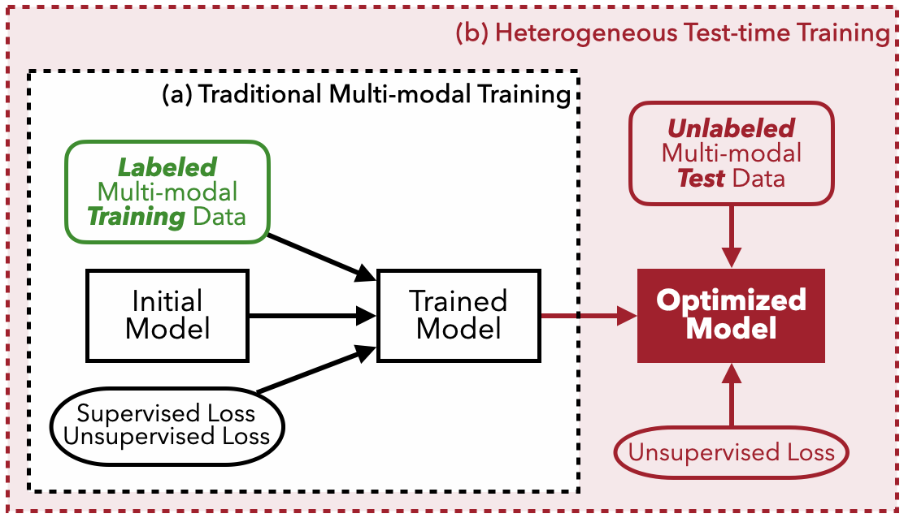
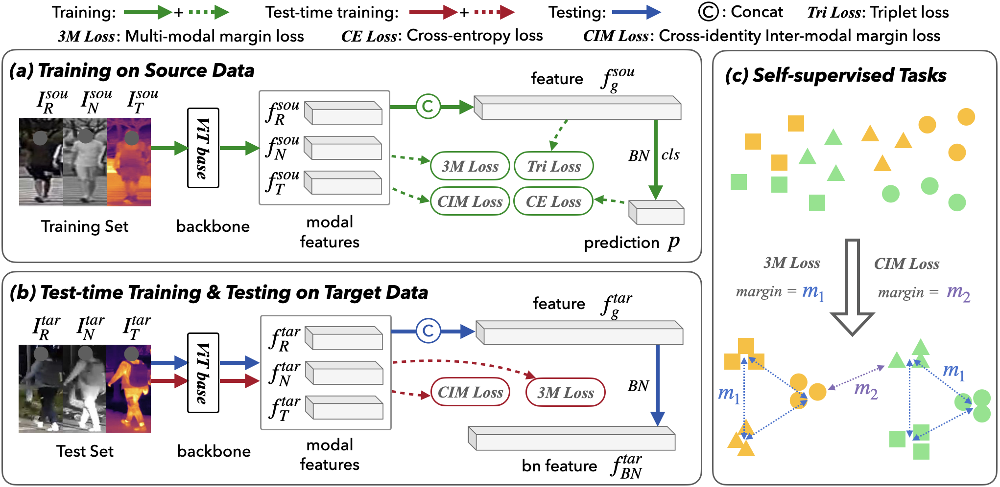
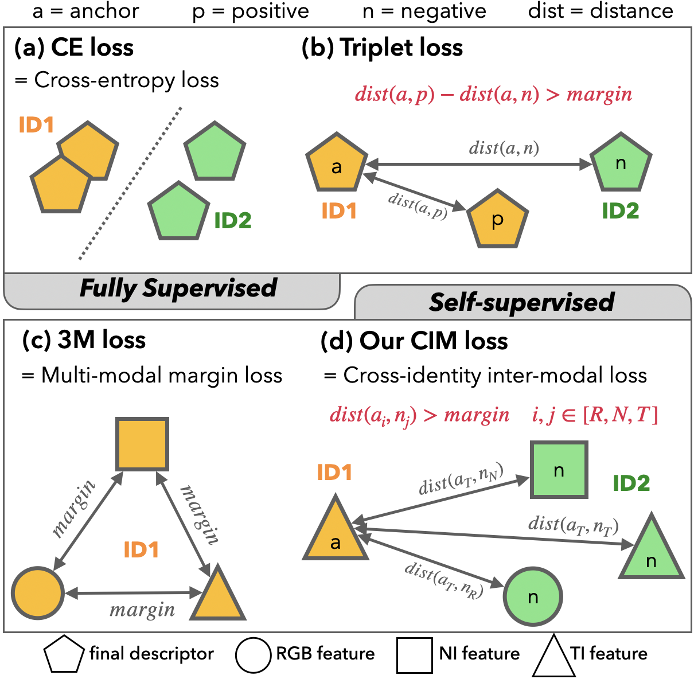
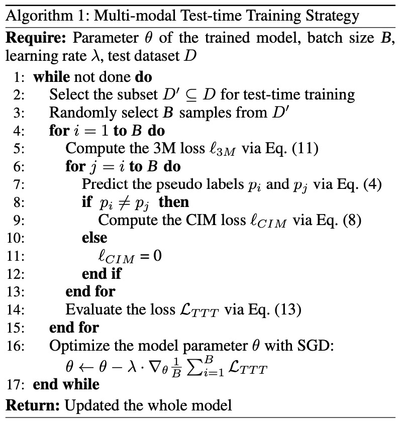
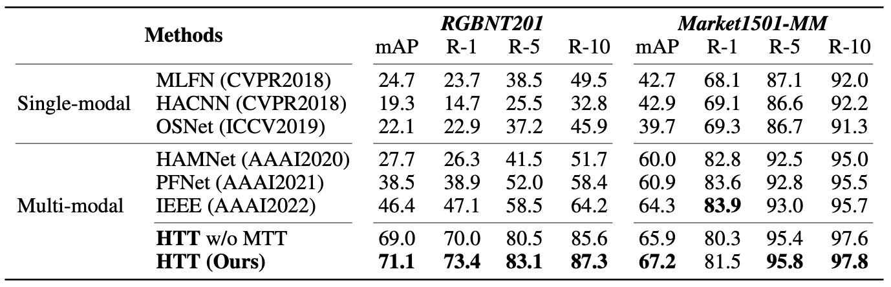
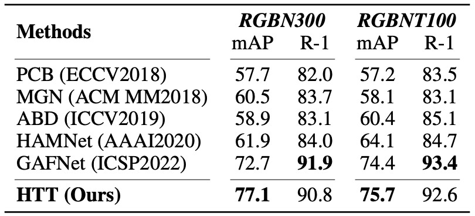

This is the official codes of our paper ***Heterogeneous Test-Time Training for Multi-Modal Person Re-identification*** [Paper Link](https://ojs.aaai.org/index.php/AAAI/article/view/28398) accepted by **AAAI 2024**.

## Overall Introduction

Inspired by the development of Test-time Training (TTT), we propose a novel method for the multi-modal person ReID task, termed ***Heterogeneous Test-time Training (HTT)***, to improve performance on unseen test data by utilizing **the relationship between heterogeneous modalities** and **fine-tuning the network before inference**.

---

(a) Traditional multi-modal training exclusively utilizes labeled training data. 
(b) The proposed heterogeneous test-time training additionally leverages unlabeled test data for optimization.

## Environment

Please follow the previous works [TransReID (ICCV 2021)](https://github.com/damo-cv/TransReID) and [IEEE (AAAI 2022)](https://github.com/ziwang1121/IEEE).

## Datasets

Multi-modality Person ReID Dataset: RGBNT201 ([Paper Link](https://ojs.aaai.org/index.php/AAAI/article/view/16467), [Download Link](https://drive.google.com/drive/folders/1EscBadX-wMAT56_It5lXY-S3-b5nK1wH?usp=sharing))

Multi-modality Vehicle ReID Datasets: RGBNT100 & RGBN300 ([GitHub](https://github.com/ttaalle/multi-modal-vehicle-Re-ID)) 

## Network

#### Overview of network

#### Highlight

1. Cross-identity inter-modal loss (CIM loss) [code](./loss/multi_modal_id_margin_loss.py)

   CE loss separates features from two identities. Triplet loss controls the distance of features. 3M loss constrains the distance among modalities in each sample. **CIM loss constrains the distance between inter-modal features from different identities.**

2. Multi-modal Test-time Training (MTT) [code](./test_time_train.py)

## Train

~~~python
# train RGBN300
python train.py --config_file configs/RGBN300/vit_base.yml
# train RGBNT100
python train.py --config_file configs/RGBNT100/vit_base.yml
# train RGBNT201
python train.py --config_file configs/RGBNT201/vit_base.yml
~~~

## Test-time Training

~~~python
# test-time training RGBN300
python test_time_train.py --config_file configs/RGBN300/vit_base_ttt.yml
# test-time training RGBNT100
python test_time_train.py --config_file configs/RGBNT100/vit_base_ttt.yml
# test-time training RGBNT201
python test_time_train.py --config_file configs/RGBNT201/vit_base_ttt.yml
~~~

## Test 

At the end of each epoch of training and test-time training, a test will be performed, and the test results can be directly seen.

Or you can run the following code to test, and note that the test model path needs to be changed.

~~~python
# test RGBN300
python test.py --config_file configs/RGBN300/vit_base_ttt.yml
# test RGBNT100
python test.py --config_file configs/RGBNT100/vit_base_ttt.yml
# test RGBNT201
python test.py --config_file configs/RGBNT201/vit_base_ttt.yml
~~~

---

Results

## Citation and Contact

~~~
@inproceedings{wang2024heterogeneous,
  title={Heterogeneous Test-Time Training for Multi-Modal Person Re-identification},
  author={Wang, Zi and Huang, Huaibo and Zheng, Aihua and He, Ran},
  booktitle={Proceedings of the AAAI Conference on Artificial Intelligence},
  volume={38},
  number={6},
  pages={5850--5858},
  year={2024}
}
~~~

If you have any questions about the project or are interested in multi-modal ReID, please feel free to contact me (ziwang1121@foxmail.com). 
